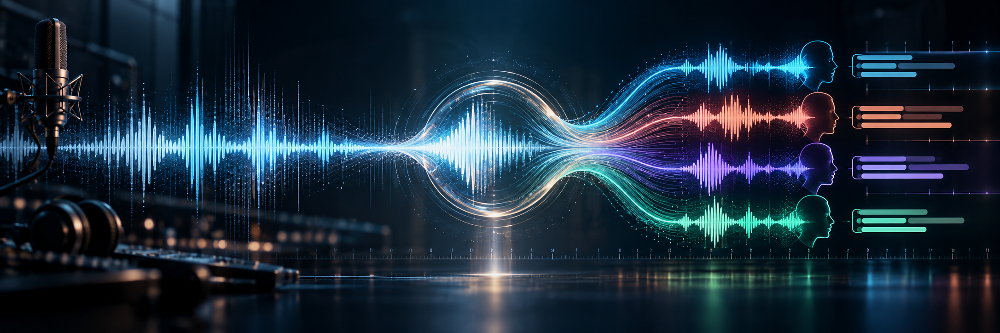

# NeMo Studio



NeMo Studio porta trascrizione, riconoscimento dei parlanti, sottotitoli, traduzione e doppiaggio su **Windows e iPhone**. Il launcher Windows usa [NeMo-Speech.cpp](https://github.com/NVIDIA/NeMo-Speech.cpp); l'app iOS è scritta in Swift e usa runtime nativi con modelli NVIDIA adattati al dispositivo.

## Perché nasce

NeMo Studio nasce per colmare un vuoto pratico: ottenere **trascrizione, riconoscimento dei parlanti, sottotitoli, traduzione e doppiaggio in un unico strumento locale**, senza dover passare per software a pagamento o abbonamenti. L'idea è rendere accessibile il flusso dalla registrazione al risultato esportabile, usando componenti aperti e lasciando i propri file sul dispositivo.

## Su Windows

- Installa e aggiorna il runtime Windows/CUDA di NeMo-Speech.cpp tramite lo script ufficiale NVIDIA.
- Avvia una pagina locale per caricare audio e video, trascrivere, tradurre e generare sottotitoli SRT, VTT e ASS.
- Può creare una traccia doppiata e inserirla in un video MKV insieme alle tracce audio originali.
- Mostra lo stato del lavoro e permette di interrompere il job. `Ctrl+C` chiude la pagina locale e i processi avviati dal launcher.

## Su iPhone

L'[app iOS](iOS/README.md) offre un'interfaccia nativa per importare audio e video, trascrivere con Nemotron 3.5, distinguere fino a quattro parlanti con Sortformer, tradurre in locale con Riva e generare voci con MagpieTTS. Esporta testo e sottotitoli SRT/VTT/ASS; per i video compatibili può creare un MOV con audio originale e doppiaggio selezionabili o un MP4 con sottotitoli impressi.

**[Scarica l'IPA unsigned dalla Release iOS](https://github.com/SiNaPsEr0x/nemo-speech-studio/releases/tag/ios-current)** e firmala con un certificato valido prima di installarla, ad esempio usando ESign. Al primo avvio premi **«Scarica / riprendi modelli»**: i pesi non sono inclusi nell'IPA, servono connessione Internet e diversi GB liberi. I download si possono interrompere e riprendere; i modelli restano nella cache privata dell'app.

Per diagnosticare un errore, abilita **Debug** in Impostazioni iOS → NeMo Studio e condividi `session.log` dall'app. Il file viene sovrascritto a ogni nuovo avvio. I preset **«Video + traccia» (MKV con sottotitoli soft)** e **«Tutto»** sono ancora disabilitati; iOS deve poter decodificare il video scelto. La compilazione e l'IPA sono state verificate in CI, mentre l'inferenza sui modelli reali richiede ancora una prova su iPhone.

## Requisiti Windows

- Windows con PowerShell **7.2 o successivo** e GPU NVIDIA supportata dal runtime CUDA di NeMo-Speech.cpp.
- Driver NVIDIA funzionante (`nvidia-smi.exe`).
- `ffmpeg.exe` e `ffprobe.exe` disponibili nel `PATH`.
- Connessione Internet per la prima installazione e per scaricare i modelli. Sono richiesti spazio su disco e memoria adeguati ai modelli scelti.

## Avvio Windows

Salva `Avvia-NeMo-Studio.ps1` sul PC. Il percorso predefinito dei dati è `D:\Modelli\NeMo-Speech`: se non hai un'unità `D:`, cambia la variabile `$Base` all'inizio dello script prima dell'avvio.

Apri PowerShell 7 nella cartella del file ed esegui:

```powershell
pwsh -NoProfile -File .\Avvia-NeMo-Studio.ps1
```

Il launcher mostra l'indirizzo della UI locale. I risultati completati vengono salvati nella cartella `Output` sotto `$Base`. Per fermare il server usa `Ctrl+C` nel terminale che lo ha avviato.

## Dati e componenti esterni

La repository contiene il launcher Windows e il sorgente dell'[app iOS](iOS/README.md), non i pesi. Il runtime, i modelli, i download, i file temporanei, i log e i risultati restano sul dispositivo: **non caricarli nella repository**. La traduzione opzionale scarica un GGUF di Riva Translate da Hugging Face e ne controlla l'hash SHA-256.

NeMo Studio è un progetto indipendente, non un prodotto ufficiale NVIDIA. NeMo-Speech.cpp e i modelli sono distribuiti dai rispettivi titolari secondo le loro condizioni. Nessun binario o peso di modello è incluso qui.

## Licenza e attribuzione

Il contenuto originale di questa repository è distribuito con [Apache License 2.0](LICENSE). Puoi usarlo, modificarlo e ridistribuirlo, anche in un progetto commerciale. **Se lo ridistribuisci o pubblichi una versione derivata**, conserva la licenza, gli avvisi di copyright e l'attribuzione contenuta in [NOTICE](NOTICE): **NeMo Studio di SiNaPsEr0x**, con link a questa repository. Segnala le modifiche ai file che hai cambiato.

Per il solo uso privato non è richiesta una menzione pubblica. Se racconti o mostri un progetto che usa NeMo Studio, una citazione a **SiNaPsEr0x** e un link alla repository sono apprezzati.

La licenza di questa repository non sostituisce le licenze dei componenti e dei modelli scaricati separatamente.

## Stato delle verifiche

L'interfaccia JavaScript e i comandi FFmpeg sono stati controllati su file di prova. L'avvio completo e la chiusura con `Ctrl+C` devono essere verificati su Windows/CUDA: non sono stati eseguiti nell'ambiente di sviluppo di questa repository. L'app iOS è stata compilata per iPhone e l'IPA verificata nella CI; l'esecuzione dei modelli sul dispositivo reale non è ancora stata verificata.
